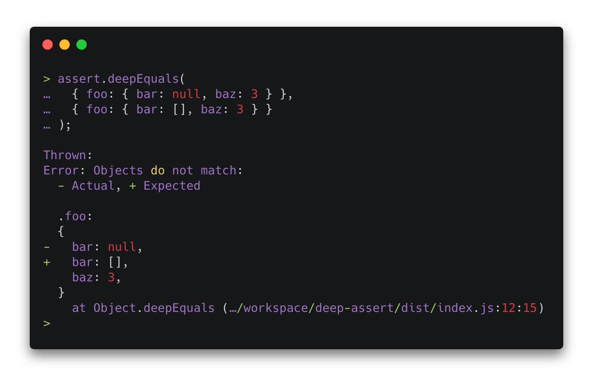

# deep-assert

Providing a better deep-equals assertion experience. Easily write object and array expectations, with `any()` and `satisfies()` or write and use your own custom assertions.

Another focus has been providing a short, but precise error output. It shows you exactly where the values don't match, even for large nested objects, yet without cluttering your console.

Works with objects, arrays, dates, buffers, etc. It's small, it's simple and it comes with zero dependencies.

<br />

<p align=center>
  
</p>

## Installation

Not yet published to npm.

## Usage

### Basic

```js
import * as assert from "assert-deep"

assert.deepEquals(getUsers() , [
  {
    id: assert.any(),
    name: "John Smith",
    active: true
  },
  {
    id: assert.any(),
    name: "Jane Smith",
    active: false
  }
])
```

### Custom assertions

```js
import * as assert from "assert-deep"

const uuidRegex = /^[0-9a-fA-F]{8}\-[0-9a-fA-F]{4}\-[0-9a-fA-F]{4}\-[0-9a-fA-F]{4}\-[0-9a-fA-F]{12}$/
const assertUUID = assert.satisfies(value => typeof value === "string" && value.match(uuidRegex))

assert.deepEquals(getUsers() , [
  {
    id: assertUUID(),
    name: "John Smith",
    active: true
  },
  {
    id: assertUUID(),
    name: "Jane Smith",
    active: false
  }
])
```

## License

MIT
